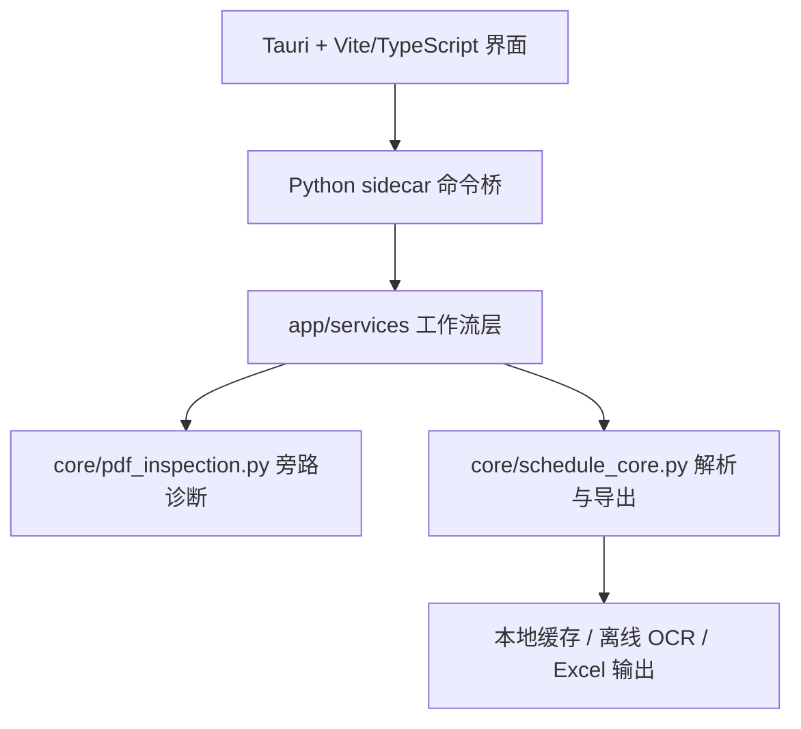

# 空谷 Konggu

<p align="center">
  
</p>

<p align="center">
  面向中英合办学生组织的离线空课生成工具。
  <br />
  批量解析中方、英方课表 PDF，合并课程占用时间，生成可直接用于排班的集体空课表。
</p>

<p align="center">
  
  
  
  
</p>


## 简介

空谷（Konggu）是青禾计划孵化的课表协作产品，服务中英合办和中外合作办学场景里的课表收集、成员排班、志愿服务和值班协作。

它解决的是收课表、看课表、比对节次、统计空闲这堆重复劳动。负责人不用再逐个成员、逐周、逐节核对两套课表，可以把精力从抄表和比表转向真正需要判断与协调的工作。

> 核心判断只有一句话：同一成员只有中方课表和英方课表都没有课，才算真正空闲。

## 目录

- [简介](#简介)
- [为什么需要空谷](#为什么需要空谷)
- [功能](#功能)
- [一个例子看懂](#一个例子看懂)
- [工作流程](#工作流程)
- [界面一览](#界面一览)
- [输入契约](#输入契约)
- [输出](#输出)
- [核心规则](#核心规则)
- [常见问题](#常见问题)
- [当前状态与已知限制](#当前状态与已知限制)
- [快速开始](#快速开始)
- [开发](#开发)
- [技术栈](#技术栈)
- [架构](#架构)
- [离线资源](#离线资源)
- [测试](#测试)
- [项目志](#项目志)
- [项目治理与协作](#项目治理与协作)
- [路线图](#路线图)
- [名称由来](#名称由来)

## 为什么需要空谷

中英合办学生通常同时持有中方课表和英方课表。人工排班时，负责人要逐个成员、逐周、逐节比对两套课表。只看一张课表容易误判：中方没课不代表英方没课。

空谷把这条链路自动化：

```text
收集课表 PDF → 识别成员和课表类型 → 解析课程占用 → 合并中英双课表 → 反推空闲时间 → 导出 Excel
```

适用场景：

| 场景 | 说明 |
| :--- | :--- |
| 值班排班 | 按成员空闲情况安排值班顺序 |
| 活动筹备 | 找出特定时段能到场的人员 |
| 志愿服务 | 从多人双课表中筛选可用人选 |
| 集中会议 | 确认大家共同空闲的时间段 |
| 培训排班 | 分批安排培训而不冲突 |

人工整理这套流程会遇到的问题，以及空谷的对应做法：

| 痛点 | 空谷的做法 |
| :--- | :--- |
| 人工整理耗时高 | 批量解析多名成员课表 |
| 重复劳动价值低 | 自动完成节次比对和名单统计 |
| 中英课表难合并 | 同一成员的中方、英方占用统一计算 |
| 人工统计容易出错 | 缺失、冲突、解析失败都会显性提示 |
| 课表包含个人信息 | 离线 Windows 桌面软件，本地处理 |

## 功能

| 功能 | 说明 |
| :--- | :--- |
| 批量导入 PDF | 一次选择多名成员的课表 PDF |
| 课表类型识别 | 按文件名识别中方、英方；识别不了就拒绝解析，不静默猜测 |
| 文件识别检查 | 在本机判断课表能否直接读取、哪些页面需要图片文字识别 |
| 本地 PDF 解析 | 优先读取文本层，文本不足时回退本地 OCR |
| 双课表合并 | 同一成员的中方、英方课表合并为完整课程占用表 |
| 空课预览 | 按周次、日期、星期、节次展示空闲人数和空闲成员 |
| 成员课表 | 核对每个成员的中方、英方课表是否齐全 |
| 待处理 | 集中显示需要核对或必须修正的内容 |
| 原文核对 | 对照 PDF 原页修正课程时间，修正必须填原因 |
| Excel 导出 | 导出经典空课表，用于排班、值班和志愿服务安排 |
| 离线资源 | 内置配置和 PP-OCRv4 mobile OCR 模型，默认不允许在线下载模型 |

## 一个例子看懂

以四名成员为例，每人交中方、英方两份课表：

```text
张三-中方课表.pdf  张三-英方课表.pdf
李四-中方课表.pdf  李四-英方课表.pdf
王五-中方课表.pdf  王五-英方课表.pdf
赵六-中方课表.pdf  赵六-英方课表.pdf
```

解析后两套课表合并成一张占用表。只看第 1 周周一 3-4 节：

| 成员 | 中方课表 | 英方课表 | 该时段是否空闲 |
| :--- | :--- | :--- | :--- |
| 张三 | 有课 | 没课 | 不空闲 |
| 李四 | 有课 | 没课 | 不空闲 |
| 王五 | 有课 | 没课 | 不空闲 |
| 赵六 | 没课 | 没课 | 空闲 |

只看英方课表，会觉得张三周一 3-4 节有空；合并后才知道中方那两节有课。所以周一 3-4 节能排的人只有赵六。

有人缺英方课表时，先到“成员课表”处理，处理完之前他不会出现在空闲名单里。

## 工作流程


| 阶段 | 数据 |
| :--- | :--- |
| 原始输入 | 成员提交的中方课表 PDF、英方课表 PDF |
| 检查与识别 | 成员姓名、课表类型、PDF 类型、逐页 OCR 建议、PDF 文本或 OCR 文本 |
| 结构化 | 成员、周次、星期、节次、课程占用 |
| 合并占用 | 同一成员的中英双课表占用合集 |
| 空闲结果 | 每个时段的空闲人数、空闲成员、有课成员 |
| 导出 | 可直接用于排班的 Excel 空课表 |

## 界面一览

主窗口分三块：左侧操作区，中间结果区，底部最近操作。界面外壳只初始化一次，处理进度、文件状态和结果内容按区域更新；切换标签时会保留原文核对的页码、缩放、滚动位置，以及课程周视图的当前周和选中状态。

```text
┌─────────────────────────────────────────────────────────────┐
│ 青禾计划 · 空谷                 青心如禾，向阳而生            │
│ 操作：导入课表  生成空课表  重新处理失败文件  导出空课表      │
│ 学期设置：第一周开始日期 / 教学周数   本地识别：就绪 / 需修复 │
├─────────────────────────────────────────────────────────────┤
│ 已选课表：张三-中方课表.pdf  张三-英方课表.pdf …               │
├──────────────┬──────────────────────────────────────────────┤
│ 共同空闲      │ 周次 日期 星期 节次 空闲人数 空闲成员 有课人员│
│ 成员课表      │                                              │
│ 文件检查      │                                              │
│ 待处理        │                                              │
│ 原文核对      │                                              │
│ 课程周视图    │                                              │
├──────────────┴──────────────────────────────────────────────┤
│ 最近操作：空课表已生成，可以导出 …                            │
└─────────────────────────────────────────────────────────────┘
```

六个视图各管一件事：

| 视图 | 核心定位 |
| :--- | :--- |
| 共同空闲 | 看每个时段谁有空、谁有课，判断能不能排 |
| 成员课表 | 核对每个成员的中方、英方课表是否齐全 |
| 文件检查 | 看每个 PDF 识别成谁、哪类课表、识别出多少有课时段 |
| 待处理 | 处理需要核对或必须修正的内容 |
| 原文核对 | 对照 PDF 原页修正课程时间，修正必须填原因 |
| 课程周视图 | 以周课表查看课程，拖拽修正后保留处理记录 |

界面的颜色、层级、最小窗口、组件、动效与无障碍约束见 [`《空谷界面设计规范》`](./docs/界面设计规范.md)。

## 输入契约

空谷优先保证结果可信，输入规则是产品契约，不是建议。

1. 文件必须是 PDF。
2. 文件名必须能看出成员姓名和课表类型。
3. 文件名必须包含“中方”或“英方”。
4. 同一成员应同时提供中方课表和英方课表。
5. 文件名无法识别课表类型时，系统暂停解析，不默认猜测。

推荐文件名：

```text
张三-中方课表.pdf
张三-英方课表.pdf
办公室-李四-中方课表.pdf
办公室-李四-英方课表.pdf
```

不接受：

```text
张三.pdf
课表1.pdf
schedule.pdf
办公室成员课表.pdf
```

## 输出

解析完成后先看三个视图，再导出 Excel。输出用界面里的视图名，跟软件里看到的一致：

| 视图 | 看什么 |
| :--- | :--- |
| 共同空闲 | 哪些周次、日期、星期、节次有多少人空闲，具体是谁 |
| 成员课表 | 每个成员是否同时导入中方和英方课表，有无缺失或冲突 |
| 文件检查 | 每个 PDF 是否识别成功，识别为谁、哪类课表、多少有课时段 |

导出的 Excel 用于实际排班。导出前先处理“待处理”中的异常；仍有必须修正的问题时，导出按钮不可用。

## 核心规则

空谷把复杂异常压缩成四条规则：

| 规则 | 判定 |
| :--- | :--- |
| 身份 | 一个 PDF 必须能关联到成员，并识别为中方或英方课表 |
| 占用 | 每个课程块只表达一件事：某人在某周、某天、某节被课程占用 |
| 完整 | 同一成员需要同时具备中方、英方课表；缺失任一类都必须提示 |
| 空闲 | 某个时段没有课程占用的成员进入空闲名单；存在缺失、冲突或解析失败时显性标记风险 |

这套规则让不同背景的使用者在点击按钮前形成同一理解：空谷不替负责人猜，它只整理可证明的空闲时间，并指出不可信的地方。

## 常见问题

**文件名不规范怎么办？**

改成“姓名-中方课表.pdf”或“姓名-英方课表.pdf”再导入。文件名里看不出课表类型时，空谷会暂停解析并列出问题文件，不会替你猜。

**提示离线材料不完整怎么办？**

空谷启动时会自动从安装包内置资源校验并恢复本地识别材料，正常情况下不需要手动操作。只有自动恢复失败时，才点击“修复识别功能”重试。开发环境可以先用 `npm.cmd run prepare:offline:dev` 跳过 OCR 模型。

**课表会传到网上吗？**

不会。空谷是离线桌面软件，PDF 只在本地读取，默认禁止模型联网下载。

**能导出什么格式？**

目前导出经典空课表 Excel（xlsx）。可视化样式导出还在暂缓清单里。

**有人只交了一份课表怎么办？**

“成员课表”会标出缺哪一类。导出前处理完，否则他的空闲时间不作数。

**解析结果看着不对怎么办？**

到“原文核对”先看文件形式、图片识别页和文字读取情况，再对照原页修改课程时间。改完必须填原因，改动会保留记录。

## 当前状态与已知限制

| 项目 | 状态 | 说明 |
| :--- | :--- | :--- |
| 单元测试 | 已验证 | 163 passed，3 warnings（2026-08-14，0.5.2 当前工作区） |
| TypeScript / 前端构建 | 已验证 | `tsc --noEmit` 与 `npm.cmd run build:frontend` 通过（46 modules） |
| 桌面层检查 | 已验证 | `cargo check --manifest-path src-tauri\Cargo.toml --locked` 通过 |
| 真实样本页级诊断 | 已验证 | 仓库外 70 份、109 页；PDF Inspector 与 PyMuPDF 的无文本层页集合一致 |
| 课程块人工真值 | 未验证 | 页级诊断一致不等于课程、周次和节次准确 |
| 正式安装包 | 已构建、已静态核验 | `Konggu_0.5.2_x64-setup.exe`，316,375,143 字节，SHA-256 `09DCDBDF0329D472A074467C7AACF45324743B4764E07D56FF513FFC55C18727`（2026-08-14，包含当前识别链路修复） |
| 全新用户目录与桌面启动 | 已验证（当前候选包组件） | 0.5.2 worker 在全新目录修复 28 项离线资源并返回 `ready: true`；当前 release 可执行文件能启动 Tauri 窗口并拉起 worker；真实另一台电脑安装尚未完成 |
| 断网、安装与卸载终检 | 未完成 | 尚未在另一台电脑完成 NSIS 安装、断网导入导出、卸载和 WebView2 环境复核；安装包未代码签名 |

已知限制：

- 版式识别以中英合办常见课表为主，没覆盖到的版式会进入“待处理”，不会静默放行。
- 当前只导出经典空课表；可视化样式、复杂筛选在暂缓清单。
- PDF Inspector 当前只提供旁路诊断，不直接改变课程块、OCR 路由或质量门禁；已完成 70 份真实样本的页级文本层对账，仍需课程块人工真值与缓存失效回归后再决定是否启用逐页 OCR。
- 未解决的异常会阻止正式导出，这是有意的。

## 快速开始

### 使用

1. 收集成员课表 PDF。
2. 按输入规则整理文件名。
3. 打开空谷。
4. 检查“本地识别”状态；如提示缺失，点击“修复识别功能”。
5. 选择所有课表 PDF。
6. 确认文件列表中每个文件都能识别出中方或英方。
7. 设置第 1 周周一和导出周数。
8. 点击“生成空课表”。
9. 先处理“待处理”里的异常。
10. 点击“导出空课表”，用于排班。

### 环境搭建

```powershell
python -m venv .venv
.\.venv\Scripts\Activate.ps1
python -m pip install --upgrade pip
python -m pip install -r requirements.txt
npm.cmd install
npm.cmd run dev
```

## 开发

<details>
<summary>开发命令：测试、构建、离线资源准备与安装包</summary>

Python 测试：

```powershell
python -m pytest -q
```

前端构建：

```powershell
npm.cmd run build:frontend
```

联网环境准备离线资源：

```powershell
npm.cmd run prepare:offline
```

开发阶段 OCR 模型暂时缺失时：

```powershell
npm.cmd run prepare:offline:dev
```

构建 Windows 安装包：

```powershell
npm.cmd run build
```

构建会先打包 Python sidecar，再按 Tauri 需要的二进制名复制。

只测试 Python sidecar：

```powershell
python -m app.sidecar --request-json "{\"command\":\"resources.status\"}"
```

</details>

## 技术栈

| 层 | 选型 | 用途 |
| :--- | :--- | :--- |
| 桌面壳 | Tauri 2 | Windows 桌面窗口与命令桥 |
| 前端 | Vite + TypeScript | 界面与状态管理 |
| 课表日历 | FullCalendar 6 | 课程周视图与拖拽修正 |
| PDF 渲染 | pdfjs-dist | 复核页原页渲染与课程块定位 |
| 解析引擎 | Python 3.12（PyInstaller 打包） | 文本层、版式识别、课程结构化、合并与导出 |
| PDF 文本 | PyMuPDF | 读取 PDF 文本层 |
| PDF 结构诊断 | pdf-inspector 0.2.6（Firecrawl，MIT） | 本地分类、逐页 OCR 原因、编码和复杂版式提示 |
| OCR | PaddleOCR（PP-OCRv4 mobile，CPU） | 文本层不足时的本地识别 |
| 表格处理 | pandas | 占用合并与统计 |
| Excel 导出 | openpyxl | 生成经典空课表 |

## 架构



| 路径 | 职责 |
| :--- | :--- |
| `src/` | 桌面界面、文件选择、解析前校验、结果预览 |
| `app/sidecar.py` | Tauri 调用的命令入口 |
| `app/services/` | 工作流编排、成员检查、预览、导出、序列化 |
| `core/` | PDF 解析、OCR 回退、课程块、占用表、Excel 工作簿 |
| `config/` | 日历、节次时间、OCR 模型与参考库配置 |
| `resources/` | 内置离线清单与 OCR 模型目录 |
| `src-tauri/` | Tauri Windows 桌面壳 |
| `tests/` | 业务规则、工作流、导出与资源检查 |

## 离线资源

发布包应包含：

```text
config/
assets/
resources/offline_manifest.json
resources/ocr_models/PP-OCRv4_mobile_det
resources/ocr_models/PP-OCRv4_mobile_rec
```

运行时，空谷会把资源校验并复制到用户可写的应用数据目录：

```text
%LOCALAPPDATA%\Konggu\resources
%LOCALAPPDATA%\Konggu\ocr_models
%LOCALAPPDATA%\Konggu\cache
%LOCALAPPDATA%\Konggu\logs
```

默认关闭 PaddleOCR 模型下载。启动时会从安装包内置资源自动初始化本地 OCR 模型；模型校验仍失败时，使用界面中的“修复识别功能”重试，或按开发说明放到本地 OCR 模型目录。

## 测试

最近一次代码验证（2026-08-14，0.5.2 当前工作区）：

```text
156 passed, 2 warnings
```

主命令：

```powershell
python -m pytest -q
```

异常矩阵见 [`docs/exception-test-matrix.md`](./docs/exception-test-matrix.md)。真实成员课表应放在版本库外，通过脱敏样本库测试。最新状态以 `docs/状态与质量门禁.md` 与 `MEMORY/事实.md` 为准。

## 项目志

项目从 V0.1、FastAPI 本地 Web、Web-only 收缩，到离线 Tauri 桌面端、0.3.0 和解析审计基线的完整沿革，记录在 [`《空谷项目志》`](./docs/PROJECT_CHRONICLE.md)。

## 项目治理与协作

长期工作规则见 [`AGENTS.md`](./AGENTS.md)，动态记忆（事实、决策、待办）见 [`MEMORY/`](./MEMORY/MEMORY.md)，参考资料库见 [`resources/reference/`](./resources/reference/README.md)，项目说明与质量门禁见 [`docs/项目说明.md`](./docs/项目说明.md) 与 [`docs/状态与质量门禁.md`](./docs/状态与质量门禁.md)，界面约束见 [`docs/界面设计规范.md`](./docs/界面设计规范.md)，测试分层见 [`tests/README.md`](./tests/README.md)。

## 路线图

### 近期重点

- 为正式样本库建立课程块人工真值和可脱敏固化的回归子集
- 逐项补齐真实 Tauri 的 accepted / needs_review / blocked / 原文核对 / 导出状态截图与 Windows 辅助功能检查
- 完成隐私与发布检查（真实姓名、路径、联网行为）
- 确认正式导出的工作表与字段

### 保留

- 批量 PDF 导入
- 双课表合并
- 成员完整性检查
- 异常状态显性展示
- 空课预览
- 经典 Excel 导出
- 离线 OCR

### 暂缓

- 可视化 Excel 样式导出
- 复杂筛选
- 云同步
- 成员数据库
- 活动报名
- 考勤统计

### 不做

- 文件名不清晰时猜测课表类型
- 导出隐藏解析失败的结果
- 用日志代替面向用户的提示

## 名称由来

空谷是青禾计划孵化的课表协作产品。

- “空”指空课表。
- “谷”承接青禾从禾苗生长为谷物的意象。

空谷在本地生成空课结果，每个 PDF 的来源和人工修正过程都可以回查。

## 认识阿谷

<p align="center">
  
</p>

阿谷是空谷的非人虚拟形象，是一只向着阳光生长的谷物精灵。双叶冠承接青禾，腹部透明种仁代表“青心”，圆润谷粒身体对应青禾最终生长为谷物的意象。

> 青心如禾，向阳而生。

桌面端中的阿谷会按界面状态执行不同动作：欢迎时蓄力跑动并挥手，处理中以有接触感的步态提示进度，可信完成时播放一次庆祝；减少动态效果时自动退化为静态姿态。角色母版、动作边界、头像、应用图标、启动页和宣传材料规范见 [`《阿谷角色与视觉使用规范》`](./docs/品牌/阿谷角色与视觉使用规范.md)。

---

最后更新：2026-08-14
